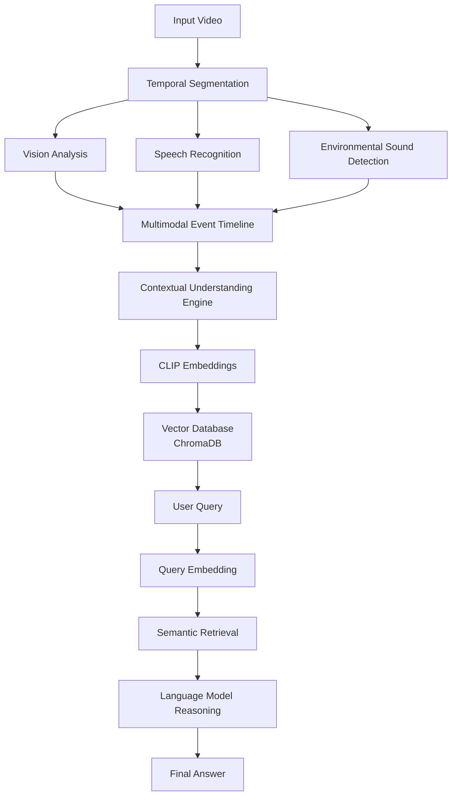

# DARSHAN

### Deep Audio-Video Retrieval for Semantic Hybrid Answering Network

[]()
[]()
[]()
[]()
[]()

DARSHAN is a **multimodal video intelligence framework** that transforms raw video into structured, searchable knowledge.
The system integrates **vision, speech recognition, environmental sound detection, semantic embeddings, and language model reasoning** to enable natural language interaction with video content.

DARSHAN is designed with a strong emphasis on **privacy-preserving AI**, enabling future deployments on **edge devices such as Raspberry Pi and NVIDIA Jetson platforms**.

---

# Table of Contents

* Overview
* Abstract
* Key Features
* Architecture
* Demo
* Installation
* Running the Pipeline
* API Usage
* Repository Structure
* Roadmap
* Limitations
* Contributing
* Citation
* References
* License
* Acknowledgements

---

# Overview

Video understanding is inherently multimodal. Humans interpret scenes using a combination of visual perception, speech understanding, contextual reasoning, and environmental audio.

DARSHAN replicates this process by combining multiple AI models into a unified system capable of answering questions about events in video streams.

Example queries:

```
When did someone enter the room?
What happened after the door opened?
When were people working together?
```

DARSHAN converts raw video into **machine-interpretable knowledge**, making it searchable and analyzable.

---

# Abstract

Understanding complex visual environments requires integrating information from multiple modalities including vision, speech, and environmental audio. Existing approaches often rely on unimodal models or manual annotations, limiting their ability to reason over temporal events in videos.

DARSHAN introduces a modular multimodal architecture that combines video segmentation, multimodal perception, semantic embeddings, vector retrieval, and language model reasoning to construct structured representations of video events.

This enables natural language querying of video streams and provides a foundation for privacy-preserving intelligent camera systems and edge AI deployments.

---

# Key Features

* Multimodal video understanding
* Automatic temporal video segmentation
* Vision-based scene description
* Speech transcription
* Environmental sound detection
* CLIP-based semantic embeddings
* Vector search using ChromaDB
* Natural language querying of video events
* FastAPI REST API interface
* Designed for edge-AI deployment

---

# Architecture

DARSHAN processes videos through a structured multimodal pipeline.



This pipeline converts **raw video → structured knowledge → natural language answers**.

---

# Demo

Example query:

```
When did someone open the door?
```

Example response:

```
A person opened the door around 22–24 seconds.
```

Future releases will include:

* interactive demo interface
* live video processing
* voice-enabled queries

---

# Installation

### Clone the repository

```bash
git clone https://github.com/nandisagnik/DARSHAN-by-8oMATE.git
cd DARSHAN-by-8oMATE
```

---

### Install dependencies

```bash
pip install -r requirements.txt
```

### Download pretrained PANNs model

This project uses the pretrained PANNs audio classifier.

Download the model:


**[Model](https://zenodo.org/records/3987831/files/Cnn14_16k_mAP=0.438.pth?download=1)**


Place the file inside:

```
panns/Cnn14_16k_mAP=0.438.pth
```

### Configure environment variables

Create a `.env` file:

```
OPENAI_API_KEY=your_api_key_here
```

---

# Running the Pipeline

### 1. Segment the video

```bash
python temporal_segments.py
```

---

### 2. Analyze segments

```bash
python analyze_segments.py
```

---

### 3. Build the vector database

```bash
python build_vector_db_clip.py
```

---

### 4. Ask questions

```bash
python ask_video_clip.py
```

Example query:

```
When did someone leave the room?
```

---

# API Usage

Start the FastAPI server:

```bash
uvicorn api:app --reload
```

Open the API documentation:

```
http://127.0.0.1:8000/docs
```

FastAPI automatically generates interactive API documentation.

---

# Repository Structure

```
DARSHAN-by-8oMATE
│
├── api.py
├── analyze_segments.py
├── temporal_segments.py
├── run_segments.py
├── build_vector_db_clip.py
├── ask_video_clip.py
│
├── panns_infer.py
│
├── class_labels_indices.csv
│
├── timeline.json
│
├── docs
│   ├── DATASET.md
│   ├── MODEL_ARCHITECTURE.md
│   ├── EXPERIMENTS.md
│
├── frontend
│   ├── style.css
│   ├── script.js
│   ├── logo.png
│   ├── index.html
│
├── audioset_tagging_cnn/
│   ├── pytorch/ # CNN model implementation
│   ├── utils/ # helper functions
│   ├── scripts/ # inference scripts
│   ├── metadata/ # dataset metadata
│   └── resources/ # class labels etc
│
├── requirements.txt
├── requirements-dev.txt
│
├── contributing.md
├── code_of_conduct.md
├── roadmap.md
├── LICENSE
└── THIRD_PARTY_LICENSES.md
```

---

# Roadmap

Planned developments include:

* Edge deployment on Raspberry Pi and NVIDIA Jetson
* Real-time video processing
* Person tracking
* Multi-video knowledge memory
* Voice-enabled user interface
* Privacy-preserving intelligent camera systems

See **roadmap.md** for details.

---

# Limitations

Current challenges include:

* latency in local model inference
* computational cost of multimodal processing
* hardware constraints for edge deployment
* limited availability of unified multimodal models

---

# Contributing

We welcome community contributions.

Please read:

**CONTRIBUTING.md**

before submitting pull requests.

---

# Citation

If you use DARSHAN in your research, please cite:

```bibtex
@software{darshan2026,
  title={DARSHAN: Deep Audio-Video Retrieval for Semantic Hybrid Answering Network},
  author={8oMATE Team},
  year={2026},
  url={https://github.com/nandisagnik/DARSHAN-by-8oMATE}
}
```

---

# References

Relevant research areas include:

* Audio-Visual Language Models (AVLM)
* Multimodal representation learning
* Video understanding and event detection
* Semantic video retrieval
* Edge AI systems

---

# License

DARSHAN is released under the **MIT License**.

See **LICENSE** for details.

---

# Acknowledgements

DARSHAN builds upon the contributions of several outstanding open-source projects:

* PyTorch
* HuggingFace Transformers
* ChromaDB
* FastAPI
* OpenCV
* Librosa

These tools make modern multimodal AI research possible.

---

# Maintainers

Developed by the **8oMATE team**

Project repository:

https://github.com/nandisagnik/DARSHAN-by-8oMATE

